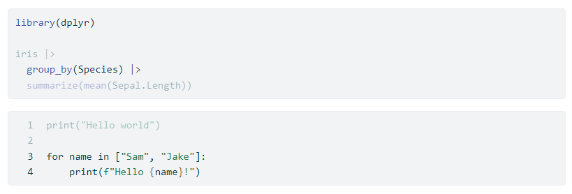
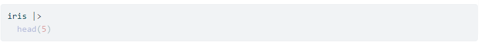
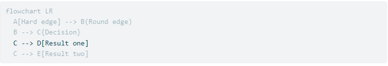
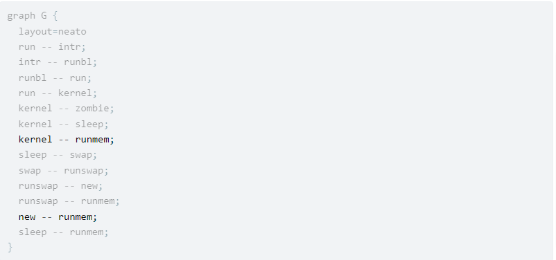
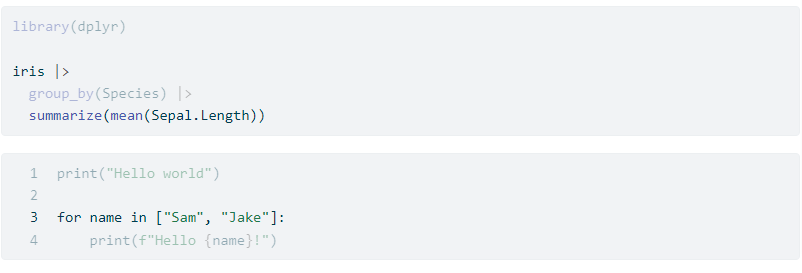

# Line-highlight Extension For Quarto

Quarto Extension to enable source code line highlighting and output line highlighting for HTML documents (`format: html`) similar to how [`code-line-numbers`](https://quarto.org/docs/reference/formats/html.html#code) works for RevealJs output.

## Installing

```bash
quarto add shafayetShafee/line-highlight
```

This will install the extension under the `_extensions` subdirectory.
If you're using version control, you will want to check in this directory.

**Please Note that, this filter extension requires Quarto v1.2 at least to work.**

## Using

Once installed, using this filter is easy. Simply add the following in your document yaml,

```
---
title: "Code Line Highlight in html"
format: html
filters:
  - line-highlight
---
```

It seems `line-highlight` filter does not works for code chunks within the [`Callout Blocks`](https://quarto.org/docs/authoring/callouts.html) or [`Tabsets`](https://quarto.org/docs/output-formats/html-basics.html#tabsets), if used as above (See [`#15`](https://github.com/shafayetShafee/line-highlight/issues/15#issuecomment-1520664357) for details). To get `line-highlight` working for code chunks within the callout blocks or tabset panels, run the `line-highlight` filter after the `quarto` filter as follows,


```
---
title: "Code Line Highlight in html"
format: html
filters:
  - quarto
  - line-highlight
---
```


### Highlighting Source Line Numbers

#### Example 01

Suppose we want to highlight the second line of a code chunk, to do that, we simply need to use the chunk option, `source-line-numbers: "2"` for that chunk.

~~~
---
title: "line highlighting"
format: html
filters:
  - line-highlight
---

```{r}
#| source-line-numbers: "2"

iris |> 
  head(5)
```
~~~


#### Example 02 (with source code line number)

Also, having the source code line numbered in such case would be helpful. We can do that by using source class `numberLines` (i.e. `#| class-source: "numberLines"`).

Here we have highlighted line number 2 and 6 to 7 and have also enabled source code line numbering using `numberLines` source-class.

~~~
---
title: "line highlighting"
format: html
filters:
  - line-highlight
---

```{r}
#| message: false
#| class-source: "numberLines"
#| source-line-numbers: "2,6-7"

# library call
library(dplyr)

# code
iris |> 
  group_by(Species) |> 
  summarize(mean(Sepal.Length))
```
~~~


### Highlighting on markdown formatted codeblocks

Highlighting will also works on syntactically formatted markdown code blocks (non-executable)(e.g. `{.r}`, `{.python}`, `{.julia}` etc)

Use `source-line-numbers` as code-block attributes (i.e. \<attribute-name\>=\<value\>),


```{.r source-line-numbers="1,4"}
library(dplyr)

iris |> 
  group_by(Species) |> 
  summarize(mean(Sepal.Length))
```

To get line numbers, use the `.numberLines` class additionally on the code-block,


```{.python .numberLines source-line-numbers="3-4"}
print("Hello world")

for name in ["Sam", "Jake"]:
    print(f"Hello {name}!")
```



For details, [see here](https://shafayetshafee.github.io/line-highlight/example.html#highlighting-on-markdown-formatted-codeblocks).


## Using Highlight Marker instead of line numbers (Added in Version 1.2.0)

It is also possible to mark a line to be highlighted in the code chunk using the highlight directive  `#<<` at the end of the line to be highlighted. Note the syntax for the highlight directive, it starts with `#` (which is the commenting character for `r`, `python` and `julia` code chunk), followed by two `<` sign.

```{r}
iris |> #<<
  head(5) 
```



And if both the `source-line-numbers` chunk option and highlight directive is used in a code chunk, only the lines with highlight-directive `#<<` will be highlighted and `source-line-numbers` will not have any effect.

```{r}
#| source-line-numbers: "2"
iris |> #<<
  head(5)
```


**Now `#<<` will work as a valid highlight directive only for `r`, `python`, `julia` code chunk, since `#` is a commenting character in these languages.** But what if we want to highlight line in `mermaid` or `dot` code chunk. For that, `#<<` will not work and syntax error will be issued. Instead, we need to use these language specific commenting characters.

But this extension uses `#<<` as a highlight directive by default. To use different syntax for highlight directive for a code chunk, use chunk option `ht-pattern` to specify the highlight directive to be used for that code chunk, where the syntax should be `<language-specific-commenting-character><<`. 

Therefore, for `mermaid` cell, `ht-pattern` should be `%%<<` and for `dot` cell, `ht-pattern` should be `//<<`. Then use these to mark a code line to be highlighted.

```{mermaid}
%%| echo: true
%%| ht-pattern: "%%<<"
flowchart LR
  A[Hard edge] --> B(Round edge)
  B --> C{Decision}
  C --> D[Result one] %%<<
  C --> E[Result two]
```




```{dot}
//| echo: true
//| ht-pattern: "//<<"
graph G {
  layout=neato
  run -- intr;
  intr -- runbl;
  runbl -- run;
  run -- kernel;
  kernel -- zombie;
  kernel -- sleep;
  kernel -- runmem; //<<
  sleep -- swap;
  swap -- runswap;
  runswap -- new;
  runswap -- runmem;
  new -- runmem; //<<
  sleep -- runmem;
}
```



It is also possible to use `#<<` to highlight lines in syntactically formatted markdown code blocks,

```{.r}
library(dplyr)

iris |> #<<
  group_by(Species) |> 
  summarize(mean(Sepal.Length)) #<<
```


```{.python .numberLines}
print("Hello world")

for name in ["Sam", "Jake"]: #<<
    print(f"Hello {name}!")
```



### Highlighting Output Line Numbers

Highlighting output line numbers a bit tricky. To enable output line number highlighting, we need to use both output class `highlight` and `numberLines` along with `output-line-numbers`.


#### Example

So to highlight second line of output, we use `output-line-numbers: "2"` and `class-output: "highlight numberLines"` (Sorry couldn't make it any more easier :D :p).

~~~
---
title: "line highlighting"
format: html
filters:
  - line-highlight
---

```{r}
#| message: false
#| source-line-numbers: "1,4"
#| class-output: "highlight numberLines"
#| output-line-numbers: "2"

library(dplyr)

mtcars |> 
  summarize(
    avg_mpg = mean(mpg)
  )
```
~~~


For a complete compilable `qmd` file with these example,

- The source code: [example.qmd](example.qmd) 
- The rendered HTML document [example.html](https://shafayetshafee.github.io/line-highlight/example.html)


## Acknowledgement

The javascript code and css for implementing ling highlighting is taken (modified and reduced) from the [Quarto Github Repo](https://github.com/quarto-dev/quarto-cli/tree/main/src/resources/formats/revealjs/plugins/line-highlight).