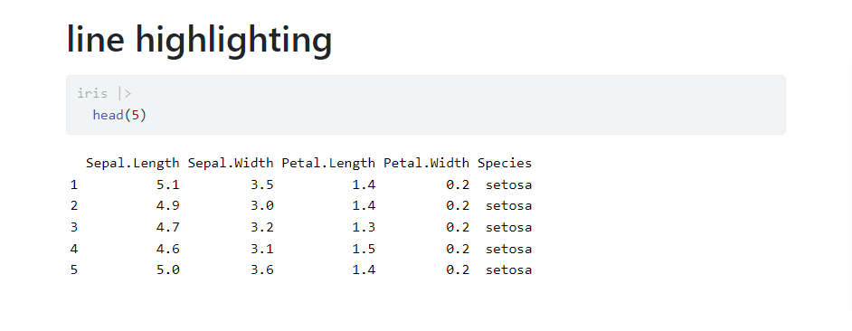
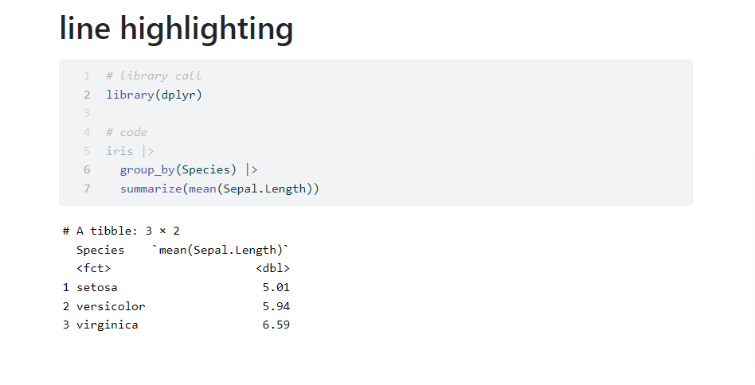
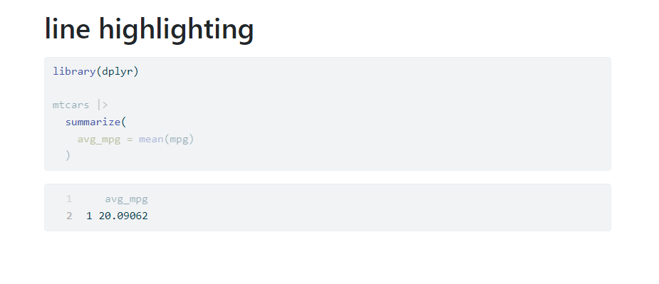

# Line-highlight Extension For Quarto

Quarto Extension to implement source code line highlighting and output line highlighting for HTML documents (`format: html`) similar as how [`code-line-numbers`](https://quarto.org/docs/presentations/revealjs/index.html#line-highlighting) works for RevealJs output.

## Installing

```bash
quarto add shafayetShafee/line-highlight
```

This will install the extension under the `_extensions` subdirectory.
If you're using version control, you will want to check in this directory.

## Using

Once installed, using this filter is easy. Simply add the following in your document yaml,

```
---
title: "Code Line Number(s) Highlight in html"
format: html
filters:
  - line-highlight
---
```


### Highlighting Source Line Numbers

#### Example 01

Suppose we want to highlight the second line of the following code chunk, to do that, we simply use, `source-line-numbers: "2"`.

~~~
---
title: "line highlighting"
format: html
filters:
  - line-highlight
---

```{r}
#| source-line-numbers: "2"

iris |> 
  head(5)
```
~~~



#### Example 02 (with source code line number)

Also, having the source code line numbered in such case would be helpful. We can do that by using source class `numberLines` (i.e. `#| class-source: "numberLines"`).

Here we have highlighted line number 2 and 6 to 7 and have also added line numbers at the left side using `numberLines` source-class.

~~~
---
title: "line highlighting"
format: html
filters:
  - line-highlight
---

```{r}
#| message: false
#| class-source: "numberLines"
#| source-line-numbers: "2,6-7"

# library call
library(dplyr)

# code
iris |> 
  group_by(Species) |> 
  summarize(mean(Sepal.Length))
```
~~~



### Highlighting Output Line Numbers

Highlighting output line numbers a bit tricky. To enable output line number highlighting, we need to use both output class `highlight` and `numberLines` along with `output-line-numbers`.


#### Example

So to highlight second line of output, we use `output-line-numbers: "2"` and `class-output: "highlight numberLines"` (Sorry couldn't make it any more easier :D :p).

~~~
---
title: "line highlighting"
format: html
filters:
  - line-highlight
---

```{r}
#| message: false
#| source-line-numbers: "1,4"
#| class-output: "highlight numberLines"
#| output-line-numbers: "2"

library(dplyr)

mtcars |> 
  summarize(
    avg_mpg = mean(mpg)
  )
```
~~~




For a complete compilable `qmd` file with these example,

- The source code: [example.qmd](example.qmd) 
- The rendered HTML document [example.html](https://shafayetshafee.github.io/line-highlight/example.html)


## Acknowledgement

The javascript code and css for implementing ling highlighting is taken (modified and reduced) from the [Quarto Github Repo](https://github.com/quarto-dev/quarto-cli/tree/main/src/resources/formats/revealjs/plugins/line-highlight).